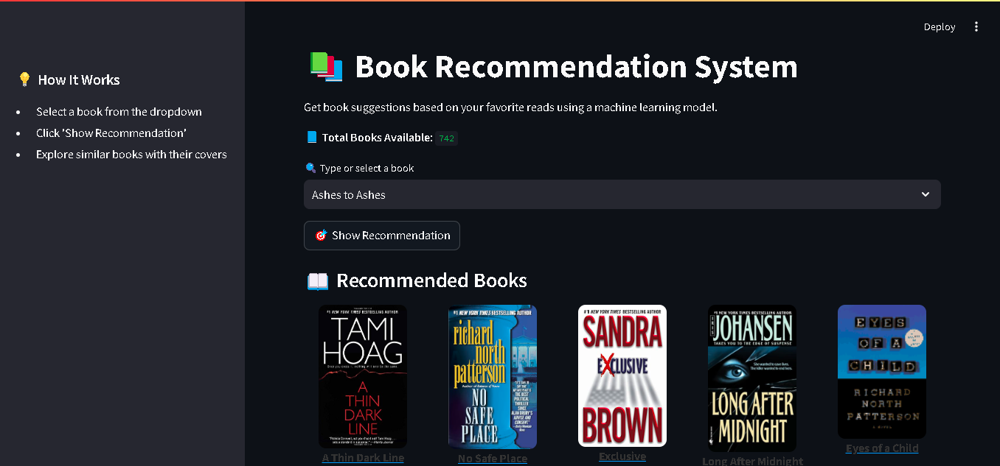

## 📚 Book Recommendation System

Get personalized book recommendations based on your favorite reads using a machine learning model – all through a sleek and interactive **Streamlit** interface.

---

### 🚀 Features

* 🔍 **Search & Select a Book** from a dropdown list
* 🎯 **Get Similar Recommendations** using KNN-based similarity
* 📘 **View Book Covers** with clickable Google search links
* 🧠 **Built with Machine Learning**, Pandas, and Scikit-learn
* 🖼️ **Cover Image Retrieval** via Google image search or a dataset

---

### 🧠 How It Works

1. **User selects a book** from the dropdown
2. A **KNN model** finds similar books based on user-item ratings
3. Similar books are displayed with their **titles and cover images**
4. Each recommendation links to a **Google search** for more info

---

### 📂 Project Structure

```
├── app.py                 # Streamlit frontend
├── train.py               # Reproducible training script (regenerates the .pkl files)
├── main.ipynb             # Original training notebook
├── NNeighbors.pkl         # Trained scikit-learn NearestNeighbors model
├── bookPivot.pkl          # Title × user_id rating pivot table (used as the KNN feature matrix)
├── bookNames.pkl          # List of book titles (== bookPivot.index)
├── finalRating.pkl        # Filtered rating frame with cover URLs (img_url, title, author, …)
├── Books.csv              # Raw books dataset
├── Ratings.csv            # Raw ratings dataset
├── Users.csv              # Raw users dataset
├── tests/                 # Smoke tests
├── Dockerfile             # Container image for deployment
├── .streamlit/config.toml # Streamlit theme + server config
├── requirements.txt       # Pinned dependencies
└── Readme.md              # This file
```

---

### 🛠️ Tech Stack

* **Python**
* **Pandas, NumPy**
* **Scikit-learn (KNN)**
* **Streamlit** – for the interactive web app
* **Pickle** – to save/load ML models

---
📸 Sample Screenshot

---

### ▶️ Getting Started

1. **Clone this repo**

```bash
git clone https://github.com/yourusername/book-recommendation-system.git
cd book-recommendation-system
```

2. **Install requirements**

```bash
pip install -r requirements.txt
```

3. **Run the Streamlit app**

```bash
streamlit run app.py
```

---

### 💡 Future Improvements

* 🧾 Add user ratings and review analysis
* 🌐 Add real-time API-based book info
* 🔎 Improve image quality with official book cover APIs (e.g. Open Library)

---

### 🙌 Acknowledgements

* Dataset inspired by public sources (e.g. Book-Crossing, Goodreads)
* UI built with 💖 using Streamlit

---

### 📬 Contact

Made with ❤️ by **\[Muhammad Hammad]**
📧 Email: [mhammad.b544@example.com](mhammad.b544@example.com)
